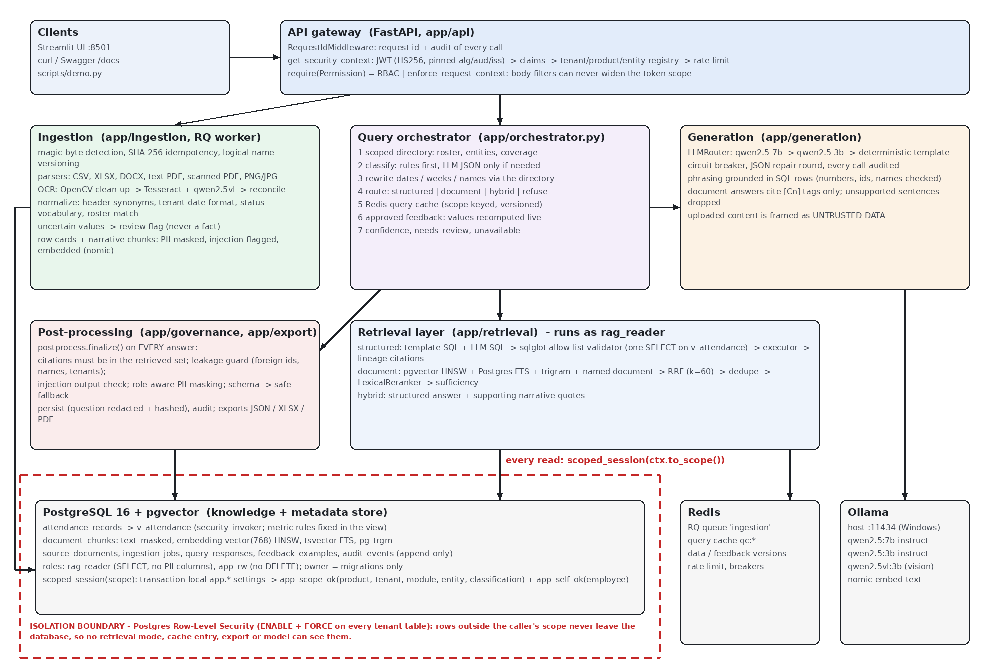

# Attendance Intelligence Microservice

An enterprise RAG microservice that ingests attendance evidence in many formats (CSV, XLSX,
DOCX, text PDF, scanned PDF, printed scans, handwriting), normalizes it into one canonical
attendance model with source traceability and confidence, and answers questions **only
from data the caller is permitted to see**, with citations, confidence and controlled
"unavailable" answers. Isolation (product, tenant, entity, module, role, classification) is
enforced by the gateway and by PostgreSQL Row-Level Security *before* anything reaches a
model: **the model never decides access.** It masks PII, resists prompt injection, audits
every call, falls back when a model fails, learns from approved reviewer feedback
(versioned, scoped, reversible) and exports JSON / XLSX / PDF.

Everything runs locally: Docker Compose + [Ollama](https://ollama.com) on the host. No API
keys.

- **Step-by-step setup from a fresh clone: [SETUP.md](SETUP.md)**
- Architecture and isolation boundary: [docs/architecture.md](docs/architecture.md)
- Test summary (mandatory scenarios, live evaluation): [docs/TEST_SUMMARY.md](docs/TEST_SUMMARY.md)
- Design decisions: [docs/DECISIONS.md](docs/DECISIONS.md)
- API: [docs/openapi.json](docs/openapi.json), Swagger UI at http://localhost:8000/docs,
  examples in [docs/api_examples.http](docs/api_examples.http)
- Demo script for the walkthrough: [docs/WALKTHROUGH.md](docs/WALKTHROUGH.md)
- Sample data and expected results: [data/README.md](data/README.md)



## Architecture in one paragraph

A FastAPI **gateway** verifies the JWT, checks the tenant/product/entity registry, applies
RBAC and a rate limit, and refuses any request field that would widen the token's scope.
**Ingestion** (RQ worker) detects the file type, de-duplicates by SHA-256, versions files by
logical name, parses tables and narrative (Tesseract + a local vision model for scans and
handwriting), normalizes headers, dates, statuses and names, flags anything uncertain for
review, and writes canonical records plus row-card and narrative chunks (PII-masked,
injection-flagged, embedded). The **query orchestrator** classifies the question (rules
first), resolves dates and names through the caller's scoped directory, and routes it:
**structured** questions run a deterministic template query and validated model-written SQL
against the `v_attendance` view and compare them; **document** questions use hybrid
retrieval (pgvector + full text + trigram, RRF fusion, reranking); **hybrid** questions do
both. **Generation** goes through a provider chain (qwen2.5 7b → 3b → deterministic
template) with a circuit breaker; answers are grounded against the rows or evidence.
**Post-processing** validates citations, blocks leakage and injected instructions, masks
PII by clearance, then the answer is persisted (question redacted + hashed) and audited.
All knowledge lives in **one PostgreSQL** (with pgvector), so a single RLS boundary protects
SQL, vector, keyword, feedback, cache-keyed and export reads alike; **Redis** holds the
queue, query cache, rate limits and breaker state.

### Technology choices and substitutions

| Reference architecture | This implementation | Why |
|---|---|---|
| API gateway | FastAPI + middleware/dependencies | typed contract, OpenAPI for free |
| Qdrant | **pgvector** HNSW (cosine) in PostgreSQL | one RLS enforcement point for all retrieval; fits 16 GB RAM |
| OpenSearch / BM25 | **PostgreSQL full-text** (`ts_rank_cd`) + **pg_trgm** | same; true BM25 is a production swap |
| Metadata DB | the same PostgreSQL 16 | transactions + RLS across records, chunks, feedback, audit |
| Redis | Redis 7 (RQ queue, query cache, rate limit, circuit breakers) | as in the reference |
| Cloud LLM chain (NVIDIA / Grok / OpenRouter / HF) | **local Ollama** `qwen2.5:7b-instruct` → `qwen2.5:3b-instruct` → deterministic template | no keys, data stays local; OpenAI-compatible adapter, so a cloud provider is configuration (blocked per tenant unless `allow_external_llm`) |
| Embedding model | Ollama **`nomic-embed-text`** (768-dim) | local |
| Cross-encoder reranker | deterministic **`LexicalReranker`** behind a `Reranker` interface | avoids a 1.1 GB CPU model; pluggable |
| OCR / handwriting service | **Tesseract** + OpenCV clean-up + local **`qwen2.5vl:3b`**, reconciled | local; uncertain values go to review |
| Frontend | **Streamlit** console that only calls the API | the brief allows a basic UI |

### Implemented vs simulated vs production

| Area | MVP (implemented) | Simulated | Production |
|---|---|---|---|
| Auth | JWT HS256 with pinned alg/aud/iss, dev-token endpoint (dev/test only) | identity provider | OIDC / RS256, key rotation, mTLS |
| Isolation | PostgreSQL RLS on every tenant table + gateway context checks | - | + per-tenant keys / sharding |
| Vector search | pgvector HNSW | - | Qdrant or a managed vector DB behind the store interface |
| Keyword search | PostgreSQL FTS + trigram | BM25 (approximate) | OpenSearch true BM25 |
| Object storage | local volume | object storage | S3-compatible + AV scanning |
| Queue | Redis + RQ (retries, failed queue, manual retry) | - | managed queue, DLQ, autoscaling |
| LLM | local Ollama 7b / 3b + deterministic template | cloud chain (config only) | GPU inference server / provider contracts |
| OCR | Tesseract + local qwen2.5vl, review flags | - | dedicated handwriting OCR, human review queue UI |
| Feedback | versioned answer templates with live recompute, rollback | fine-tuning adapter | approval workflow, four-eyes review |
| Audit | append-only table (`audit_events`) | SIEM export | SIEM, immutable storage |
| Secrets | `.env` | vault | Vault / KMS |

## Security model

- **Gateway:** JWT verification (algorithm pinned, `none` rejected, audience/issuer/required
  claims, clearance ceiling per role), registry check, per-subject rate limit, RBAC
  (`require(Permission)`), and `enforce_request_context`: a body or filter may repeat the
  token's tenant/product/module/entity but never widen it → `403 CONTEXT_MISMATCH` before
  retrieval. Employees can only query themselves.
- **Database boundary:** every request-time read/write runs in
  `scoped_session(ctx.to_scope(), role)`: transaction-local settings + RLS policies
  (`app_scope_ok`, `app_self_ok`), `ENABLE` + `FORCE`, fail-closed. Roles: `rag_reader`
  (SELECT only, no PII columns / raw values / raw chunk text), `app_rw` (no DELETE, audit
  insert-only); the owner role is used only by migrations, seeding and maintenance scripts.
- **Model-written SQL:** sqlglot allow-list validator (one `SELECT` on `v_attendance`,
  allow-listed columns/functions/casts, no CTE/UNION/comments/parameters, ≤ 1 self-join,
  `LIMIT` ≤ 500), then executed as `rag_reader` under RLS. The validator is the only layer
  that stops `set_config()`/`current_setting()` in model SQL (rag_reader needs `set_config`
  for its own scope), so `exp.Anonymous` functions stay rejected.
- **Prompt injection:** uploaded content is data; injection-like chunks are flagged at
  ingestion, marked in prompts, excluded from sufficiency and extractive quotes, and any
  answer that repeats instructions or claims elevated modes is withheld.
- **Output guard:** `postprocess.finalize()` on every answer: citations must be in the
  retrieved set; out-of-scope ids/names/tenants → answer withheld (`blocked`) and a
  `security_block` audit event; PII masked (last 4 digits kept only for restricted
  clearance); schema validation with a safe fallback.
- **Existence is never leaked:** another tenant's employee and a non-existent one produce
  identical responses; other scopes' request ids are `404 Not found`.
- **PII:** phone / e-mail / national id encrypted at rest (Fernet) in `employees`, never
  readable by `rag_reader`; masked in chunks, answers, exports; questions stored redacted and
  hashed; tokens and secrets never logged.
- **Audit:** append-only `audit_events` for every HTTP request, query (mode, sources, provider
  path, confidence, outcome, cache), LLM call, security block, ingestion stage, feedback
  change and export.

## Setup

The full step-by-step guide, with Windows PowerShell commands and troubleshooting, is in
[SETUP.md](SETUP.md). Short version:

Requirements: Docker Desktop, [Ollama](https://ollama.com) on the host, ~16 GB RAM.

```bash
ollama pull qwen2.5:7b-instruct
ollama pull qwen2.5:3b-instruct
ollama pull nomic-embed-text
ollama pull qwen2.5vl:3b
```

`qwen2.5vl:3b` (~3.2 GB) reads handwriting. It runs in the ingestion worker and takes about
4 minutes per handwritten image on CPU (`VISION_TIMEOUT_S=600`). Without it the system still
works, but handwriting is read by Tesseract only, every handwritten row goes to review, and
the deliberately messy sheet cannot be read at all.

```bash
cp .env.example .env
```

Edit `.env`: set `JWT_SECRET` to a long random string; set `POSTGRES_PASSWORD` and use the
same value in `DATABASE_URL_OWNER`; choose passwords for `app_rw` and `rag_reader` in
`DATABASE_URL_APP` / `DATABASE_URL_READER` (the migration creates those roles with them);
set `PII_ENCRYPTION_KEY` to a Fernet key:

```bash
docker compose run --rm -T api python -c "from cryptography.fernet import Fernet; print(Fernet.generate_key().decode())"
```

Start, migrate, seed, index:

```bash
docker compose up -d --build
docker compose run --rm -T api alembic upgrade head
docker compose run --rm -T api python -m scripts.seed
docker compose run --rm -T api python -m scripts.demo --full
```

`scripts.demo --full` uploads every sample file through the API (the worker parses,
normalizes and embeds them) and then runs the whole checklist: answer with citations,
unavailable answers, blocked cross-tenant requests, the three exports, feedback with a
repeat query, and rollback. It exits non-zero if any check fails.

- API: http://localhost:8000 (Swagger `/docs`) · UI: http://localhost:8501
- Postgres is published on host port **5433**, Redis on **6380**.
- After changing ingestion code: `docker compose restart worker`.
- Embeddings missing (e.g. Ollama was down during ingestion):
  `docker compose run --rm -T api python -m scripts.reindex`.

## Using it

```bash
TOKEN=$(curl -s -X POST localhost:8000/v1/auth/dev-token -H "Content-Type: application/json" -d '{"persona":"a_eng_manager"}' | python -c "import sys,json;print(json.load(sys.stdin)['access_token'])")
curl -s -m 300 -X POST localhost:8000/v1/query -H "Authorization: Bearer $TOKEN" -H "Content-Type: application/json" -d '{"question":"Who was present on 1 September 2026?"}'
```

Answers that call a model take ~30-90 s on CPU (the first after a model load up to ~3 min);
refusals, denials and no-data answers are immediate; repeats are served from the cache.

Personas (dev tokens, from `scripts/seed_spec.yaml`):

| Persona | Tenant | Role | Entities | Clearance |
|---|---|---|---|---|
| `a_hr_admin` | tenant_a | hr_admin | * | restricted |
| `a_eng_manager` | tenant_a | manager | engineering | internal |
| `a_hr_manager` | tenant_a | manager | hr | internal |
| `a_employee_e001` | tenant_a | employee (E001) | engineering | internal |
| `a_reviewer` | tenant_a | reviewer | engineering | internal |
| `a_auditor` | tenant_a | auditor | * | internal |
| `b_manager` / `b_reviewer` | tenant_b | manager / reviewer | * | internal |
| `x_other_product` | tenant_a, product hrms_ai | manager | * | internal |

Roles: hr_admin = everything; manager = ingest, query, export; reviewer = query + feedback;
employee = own records only; auditor = audit log only.

Endpoints (all under `/v1`; full contract in `docs/openapi.json`):

| Capability | Endpoint |
|---|---|
| Health | `GET /health`, `GET /health/deep` |
| Context | `GET /me`, `GET /audit?request_id=` |
| Ingestion | `POST /ingest`, `GET /jobs`, `GET /jobs/{id}`, `POST /jobs/{id}/retry`, `GET /documents`, `GET /documents/{id}/records` |
| Query | `POST /query`, `GET /query/{request_id}` |
| Feedback / training | `POST /feedback`, `GET /feedback`, `GET /feedback/{id}`, `POST /feedback/{id}/deactivate`, `POST /feedback/{id}/rollback` |
| Export | `POST /export` (`source` records or query; `format` json, xlsx, pdf) |
| Dev only | `POST /auth/dev-token`, `GET /auth/personas` (not mounted in production) |

### Feedback loop and rollback path

1. A reviewer (or HR admin) sends `POST /v1/feedback` with the `original_request_id`, a
   `feedback` note and an `ideal_final_output`. The original answer must be visible in the
   reviewer's scope (else 404).
2. The service re-analyses the question in the reviewer's scope, turns the ideal output into
   a template whose numbers/names/dates must all be supported by the live rows (otherwise the
   example is `rejected` with the unsupported values listed), stores it as the next
   **version** of its lineage (product, tenant, module, entity, intent), retires the
   previous version, and re-runs the question to verify (`matches_ideal`).
3. Later equivalent questions (same intent signature, similarity ≥ 0.85) from any caller
   whose RLS scope covers that example get the approved wording, with values recomputed from
   live data; other tenants/entities/products never see it.
4. `POST /v1/feedback/{id}/rollback` reactivates the previous version;
   `POST /v1/feedback/{id}/deactivate` switches an example off. Both are audited and bump
   the feedback version, which invalidates cached answers.

## Environment variables

| Variable | Default / example | Purpose |
|---|---|---|
| `APP_ENV` | `dev` | `dev`/`test` mount the dev-token routes; `prod` does not |
| `LOG_LEVEL` | `INFO` | JSON logs, one object per line with `request_id` |
| `JWT_SECRET`, `JWT_ALG`, `JWT_TTL_MIN` | -, `HS256`, `60` | token signing |
| `POSTGRES_USER`, `POSTGRES_PASSWORD` | `postgres` | database container |
| `DATABASE_URL_OWNER` / `_APP` / `_READER` | see `.env.example` | owner (migrations only), `app_rw`, `rag_reader` |
| `REDIS_URL` | `redis://redis:6379/0` | queue, cache, rate limit, breakers |
| `PII_ENCRYPTION_KEY` | Fernet key | encryption of employee PII at rest |
| `INGEST_SYNC` | `false` | `true` processes uploads in-request (tests) |
| `MAX_UPLOAD_MB` | `20` | upload size limit |
| `LLM_CHAIN` | `ollama-primary,ollama-fallback,template` | provider order |
| `OLLAMA_BASE_URL` | `http://host.docker.internal:11434/v1` | Ollama on the host |
| `OLLAMA_PRIMARY_MODEL` / `OLLAMA_FALLBACK_MODEL` | `qwen2.5:7b-instruct` / `qwen2.5:3b-instruct` | text models |
| `OLLAMA_VISION_MODEL`, `VISION_CHAIN` | `qwen2.5vl:3b`, `ollama-vision` | handwriting OCR |
| `LLM_TIMEOUT_S`, `VISION_TIMEOUT_S`, `BREAKER_FAILS`, `BREAKER_RESET_S` | `90`, `600`, `3`, `60` | timeouts (vision OCR runs in the worker, so it may wait longer) and circuit breaker |
| `EMBEDDER`, `OLLAMA_EMBED_MODEL`, `EMBED_DIM` | `ollama`, `nomic-embed-text`, `768` | embeddings |
| `RERANK_MODEL` | (unused) | kept for a future cross-encoder |
| `OCR_REVIEW_THRESHOLD` | `0.75` | below this, OCR values go to review |
| `FEEDBACK_MATCH_THRESHOLD` | `0.85` | similarity needed to reuse an example |
| `CONF_HIGH`, `CONF_LOW` | `0.85`, `0.60` | confidence bands |
| `CACHE_TTL_S` | `600` | query cache TTL (`0` disables) |
| `RATE_LIMIT_PER_MIN` | `60` | per subject |
| `API_URL`, `UI_HTTP_TIMEOUT_S` (ui service) | `http://api:8000`, `300` | Streamlit → API |

## Tests

```bash
bash scripts/gate.sh 80          # ruff check + format check + pytest -m "not live" + coverage >= 80%
.\scripts\gate.ps1 -Floor 80     # the same on Windows PowerShell
docker compose run --rm -T api pytest -m live -s -q tests/live/test_eval_questions.py
docker compose run --rm -T api python -m scripts.eval_report    # regenerates docs/TEST_SUMMARY.md
docker compose run --rm -T api python -m scripts.ocr_eval
```

908 automated tests (unit, integration, security, OCR, e2e) run against a separate
`attendance_test` database with mock models and deterministic embeddings, at 96% line
coverage. The live suite runs the demo questions against the real stack (23/24 pass; see the
summary for the one known gap). Markers: `unit`, `integration`, `security`, `ocr`, `e2e`,
`live` (excluded from the gate).

## Known limitations

- **CPU inference is slow**: ~30-90 s for answers that call a model (up to ~3 min cold).
  Feedback submission re-runs the question.
- **Handwriting goes to human review.** `qwen2.5vl:3b` reads both handwritten samples
  (field accuracy 100% on the clean sheet, ~78% on the deliberately messy one), but a 3B
  vision model is not reliable enough to be trusted on its own: a row is only stored as
  fact when the model reports no doubt and Tesseract does not contradict it. On the sample
  sheets the model reports doubt on every row, so all handwritten rows wait for review and
  no wrong value is ever stored as fact (`scripts.ocr_eval`). A larger vision model would
  let more rows through automatically. Without the vision model, the messy sheet cannot be
  read at all and clean handwriting is read by Tesseract only (all rows in review).
- OCR row numbers for images count the rows that were read; a skipped line in an arbitrary
  photo would shift locators. PDF tables that continue on a page without a repeated header
  are not joined.
- Keyword search is PostgreSQL FTS, not true BM25; the reranker is lexical, not a
  cross-encoder.
- The leakage guard's person-name detection is heuristic (capitalised word pairs not in the
  scoped roster/evidence).
- Feedback templating needs the ideal output to state values in the system's format
  (e.g. `91.83`, `01/09/2026`); otherwise the example is rejected with the unsupported values.
- The query cache is per user and date; seeding the roster again does not bump the data
  version (entries expire after `CACHE_TTL_S`).
- A client re-using an `X-Request-ID` gets a fresh answer, but `GET /v1/query/{id}` returns the
  first stored one.
- The schema owner is the Postgres superuser (migrations/seeding only). Production: a
  separate non-superuser owner and managed secrets.
- Rate limiting and circuit breakers fail open if Redis is down (service reported degraded).

## Repository map

```
app/            api/ (gateway, routes) · security/ · db/ (models, migrations) · ingestion/
                retrieval/ (classifier, rewrite, sql/, documents, fusion, stores)
                generation/ (router, providers, prompts) · governance/ · feedback/ · export/
                orchestrator.py · cache.py
ui/             Streamlit console (client.py is its only HTTP path)
scripts/        seed, generate_data, reindex, demo, eval_live, eval_report, ocr_eval,
                export_openapi, render_architecture, gate.sh / gate.ps1
data/           generated/ sample files · ground_truth/ expected results · schema/ canonical model
docs/           architecture, decisions, OpenAPI, API examples, walkthrough, test summary
tests/          unit · integration · security · ocr · e2e · live
```
