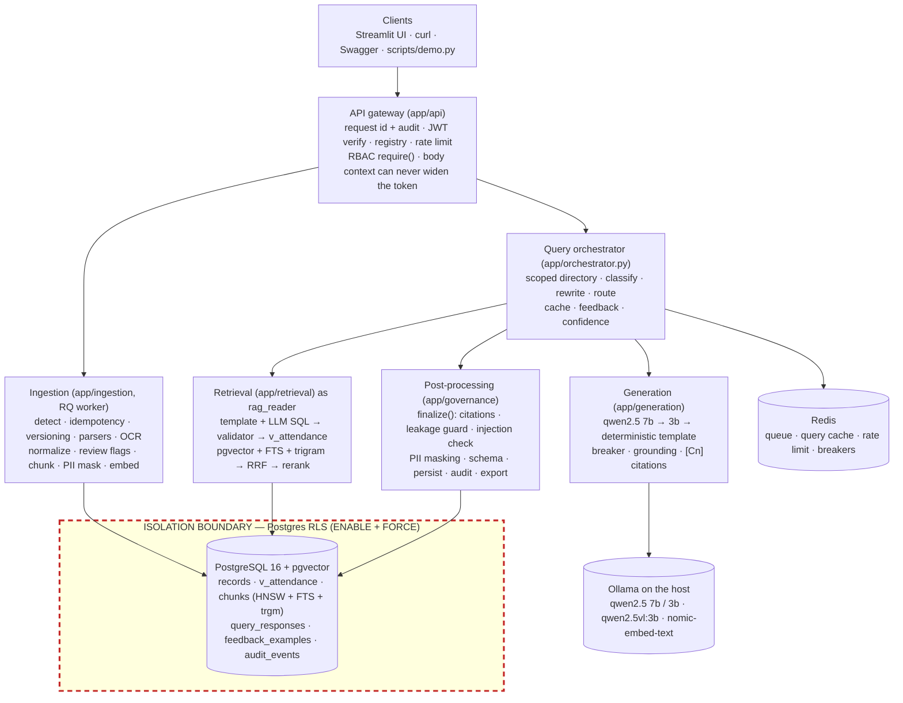

# Architecture

`architecture.png` is rendered by `python -m scripts.render_architecture`; the same picture as
Mermaid:

## Reference layers → modules

| Reference layer (assignment figure) | Implementation | Key modules |
|---|---|---|
| API gateway | FastAPI app factory, middleware and dependencies | `app/main.py`, `app/api/middleware.py`, `app/api/deps.py`, `app/security/{jwt,context,rbac,ratelimit}.py` |
| Ingestion | Upload → RQ job → parse → normalize → persist → index | `app/ingestion/service.py`, `worker.py`, `detect.py`, `parsers/*`, `normalize/*`, `ocr/*`, `chunking.py` |
| Knowledge stores | One PostgreSQL (metadata, canonical records, vectors, full text) + Redis | `app/db/models.py`, `app/db/migrations/versions/0001-0004`, `app/retrieval/stores.py` |
| Query orchestrator | One `QueryRun` per request | `app/orchestrator.py`, `app/retrieval/{classifier,rewrite}.py`, `app/cache.py` |
| Retrieval layer | Structured (text-to-SQL + templates) and document (hybrid vector/keyword) retrieval | `app/retrieval/sql/*`, `app/retrieval/{documents,fusion,embeddings,indexing}.py` |
| Generation + provider chain | Local model chain with a deterministic last resort | `app/generation/{router,breaker,prompts,phrasing,document_answer,answer_templates}.py` |
| Post-processing / governance | Output guard on every response, confidence, audit | `app/governance/{postprocess,grounding,confidence,audit}.py`, `app/security/{pii,injection}.py` |
| Feedback / training loop | Versioned, scoped answer templates with live recompute | `app/feedback/{service,store,templating}.py`, `app/api/routes_feedback.py` |
| Export | One dataset, three renderers | `app/export/{dataset,renderers}.py`, `app/api/routes_export.py` |

## Where isolation is enforced

Isolation is enforced in layers; the model never decides access.

1. **Gateway**: the JWT is verified (pinned algorithm, audience, issuer, required claims,
   clearance ceiling per role) and its tenant/product/entities are checked against the
   registry. `require(Permission)` enforces RBAC. `enforce_request_context` rejects any
   body or filter value (tenant, product, module, entity, another employee) outside the
   token with `403 CONTEXT_MISMATCH`, before any retrieval.
2. **Database (the boundary)**: every request-time read and write runs in
   `scoped_session(ctx.to_scope(), role)`, which writes the caller's scope into
   transaction-local settings. Row-Level Security policies (`app_scope_ok` for
   product/tenant/module/entity/classification, `app_self_ok` for the employee role) are
   `ENABLE`d and `FORCE`d on every tenant table, including `document_chunks`, so vector,
   full-text and trigram search, SQL, feedback matching, exports and stored responses are
   all filtered by the same policy. Least-privilege roles: `rag_reader` has `SELECT` only and
   no access to PII columns, raw values or raw chunk text; `app_rw` cannot `DELETE`; the
   owner role is used only by migrations, seeding and maintenance scripts.
3. **SQL validator**: model-written SQL must be one `SELECT` on `v_attendance` using
   allow-listed columns and functions (no CTEs, UNION, comments, parameters or
   `set_config`), and it runs as `rag_reader` under RLS anyway.
4. **Before the model**: prompts are built only from rows and chunks that RLS already
   filtered; uploaded text is framed as untrusted data, and flagged chunks are marked.
5. **After the model**: `postprocess.finalize()` drops citations that were not retrieved,
   withholds answers that mention out-of-scope ids, names or tenants, blocks
   instruction-like output, masks PII by clearance and validates the response schema.
6. **Denials do not leak existence**: another tenant's employee gets exactly the same
   response as a non-existent one; a request id from another scope is `404 Not found`.
7. **Cache**: the Redis query-cache key contains the full scope (incl. user and role), and a
   hit is re-finalized under the caller's scope.

## Technology substitutions (reference figure → this MVP)

| Reference | Used here | Why |
|---|---|---|
| Qdrant | pgvector HNSW (cosine) inside PostgreSQL | one RLS enforcement point for every retrieval mode; fits 16 GB |
| OpenSearch / BM25 | PostgreSQL full-text search (`ts_rank_cd`, any-term query) + `pg_trgm` | same reason; true BM25 is a documented production swap |
| Separate metadata DB | the same PostgreSQL | transactions + RLS across records, chunks, feedback and audit |
| Cloud LLM chain (NVIDIA/Grok/OpenRouter/HF) | local Ollama qwen2.5:7b → qwen2.5:3b → deterministic template | no API keys, data never leaves the machine; the adapter is OpenAI-compatible, so a cloud provider is a config change (blocked per tenant by `allow_external_llm`) |
| Hosted embedding model | Ollama `nomic-embed-text` (768-dim) | local, no extra download stack |
| Cross-encoder reranker | deterministic `LexicalReranker` behind a `Reranker` interface | avoids a 1.1 GB model on CPU; a cross-encoder plugs into the same interface |
| Handwriting OCR service | Tesseract + local `qwen2.5vl:3b` vision model, reconciled; uncertain values go to review | local only |
